这周每天都会拿出一两个小时的时间来看这本《深入学习入门：基于 Python 的理论与实现》，每天学到了什么东西都会简单的记几笔，以下就是我这些略显零散的笔记的汇总。

## 第一二章

第一章基本上就是在复习第一本书的内容。主要谈了数学和 Python——矩阵的运算、多维数组的广播、矩阵形状的检查，以及如何在 Python 中做这些操作……其中值得注意的是提到了 Sum 节点、MatMul 节点的反向传播，这个是第一本书里没有提到的。

第二章开始就正式进入自然语言处理（NPL）的世界。自然语言处理是非常有难度的课题，它是人工智能皇冠上的明珠。在 NLP 领域，深度学习占据了非常重要的地位。搜索引擎和机器翻译等大量应用中都采用了 NPL 技术。

自然语言处理第一个要解决的问题就是让计算机理解单词的含义，有三种方法：同义词词典、计数（基于统计）、推理（基于深度学习）。

同义词词典就是根据单词的相似度把它们联系起来生成的图，最著名的同义词词典是 WordNet。同义词词典的问题：难以顺应时代、人力成本高、无法表示单词的微妙差别。

最有名的语料库应该是维基百科，文学作品、论文等各类出版物也经常被用作语料库。

分布式假设所表达的理念非常简单，主要是两点核心思想，第一，单词本身没有含义，单词含义由它所在的上下文（语境）形成，第二，含义相同的单词经常出现在相同的语境中。

通过共现矩阵将单词表示为了向量，然后就可以通过数学的方法对单词进行相关的计算了，比如说计算两个单词的关联度。

PPMI 矩阵是对共现矩阵的一种改进。但 PPMI 矩阵还是存在一个很大的问题，那就是随着语料库的词汇量增加，各个单词向量的维数也会增加。如果语料库的词汇量达到 10 万，则单词向量的维数也同样会达到 10 万。实际上，处理 10 万维向量是不现实的。并且向量中的绝大多数元素并不重要，也就是说，每个元素拥有的“重要性”很低。这就需要降维处理了。

降维的方法有很多，这本书上用到的是奇异值分解(Singular Value Decomposition，SVD)。 这一块是线性代数的知识，可以去看看 3b1b 的线性代数教程，通过可视化的方式更好地理解线性代数。

## 第三四章

基于计数的方法在处理大规模语料库时会出现问题。

神经网络可以分批次学习数据，而不用一股脑全部学了。

这一章主要讲了 word2vec 与其 CBOW 模型。

## 第四章

第四章讲了神经网络的学习，这里所说的“学习”是指从训练数据中自动获取最优权重参数的过程。

我们需要发现数据里的模式，那么就需要发现其中的特征量（也就是神经网络的中间层的节点），什么是特征量呢，比如说一句话的情感特征（生气、冷漠、好奇、礼貌、开心）、一个狗的图像的特征部位（眼睛、鼻子、耳朵、腿、尾巴）。一个例子是图二里的数字手写字，9 的特征就是有一个圈和一个竖，这个就是特征，将其量化后就叫特征量。

第一种，先从数据中提取特征量，再用机器学习技术学习这些特征量的模式。 在计算机视觉领域，常用的特征量包括 SIFT、SURF 和 HOG 等，使用这些特征量将图像数据转换为向量，然后对转换后的向量使用机器学习中的 SVM、KNN 等分类器进行学习。

第二种，神经网络中，连重要特征量也都是由机器来学习的。（可能是我们人类无法理解的一些特征量）

另外讲到了损失函数的概念，损失函数用于衡量神经网络模型的性能。通过将模型的预测值与应该输出的实际值进行比较，该函数将实质上计算出模型的执行效果。一般有均方误差 、交叉熵误差。神经网络训练的过程就是最小化损失函数的过程。（图三描绘地很清楚了）

这一章剩下的部分基本上都在讲高数（微分、导数、偏导、梯度），下一次打卡再总结。

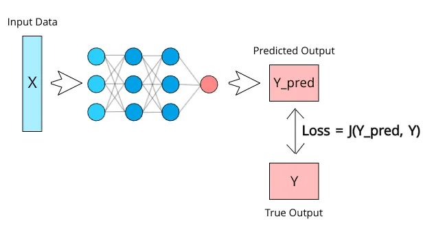

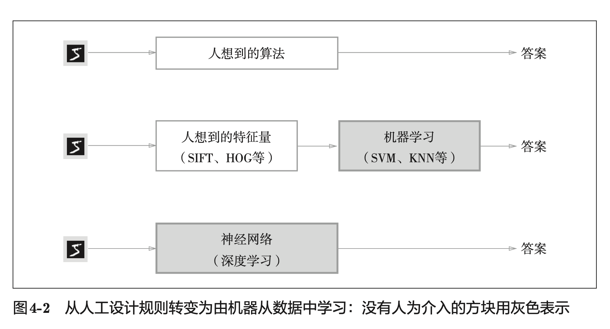

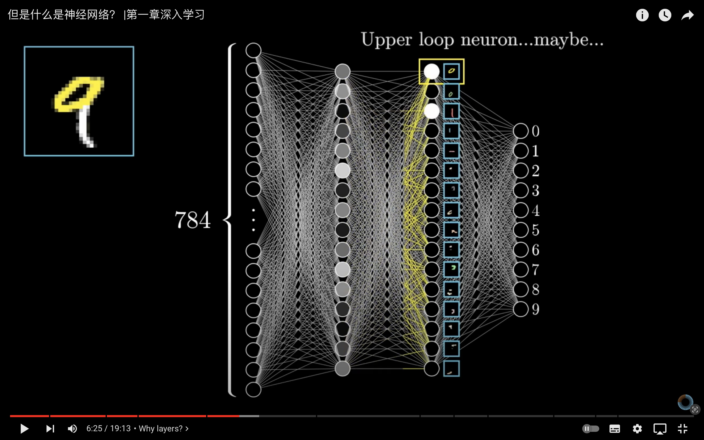

## 第五章

第五章只讲了一个事情——误差反向传播（Back-propagation, BP）。

误差反向传播算法的出现是神经网络发展的重大突破，也是现在众多深度学习训练方法的基础。

我们先要理解，反向传播算法解决了什么问题。在我的上一个读书笔记里，我说到过，神经网络的训练过程就是一个不断求解梯度，然后下降，然后求解梯度，然后下降……循环往复直到找到最优解的一个过程。而到目前为止，求解梯度的方法当目前为止只说了数值微分的方法，这种方法的计算太耗时了，而反向传播就是用来快速求解梯度（导数）的。

反向传播不是那么容易理解，除了书本之外，我还推荐 3b1b 的视频：

-   https://www.youtube.com/watch?v=Ilg3gGewQ5Uh
-   https://www.youtube.com/watch?v=tIeHLnjs5U8

这两个视频好好看一遍，基本上就理解了反向传播的原理，实际上本质就是对微分链式法则的一个应用。

第五章另外一大任务就是用代码（Python）实现反向传播的算法。

它分成了几种层去单独实现：简单层（加法和乘法）、激活函数层（sigmoid 函数、ReLU 函数）、Affine/Softmax 层。每种类型层的实现中都包括了一个 forward 函数和 backward 函数，分别表示正向传播和反向传播。最终再把这些层组合起来，就获得了误差反向传播法的实现。

理解了反向传播算法后，整个实现也是非常容易理解的。

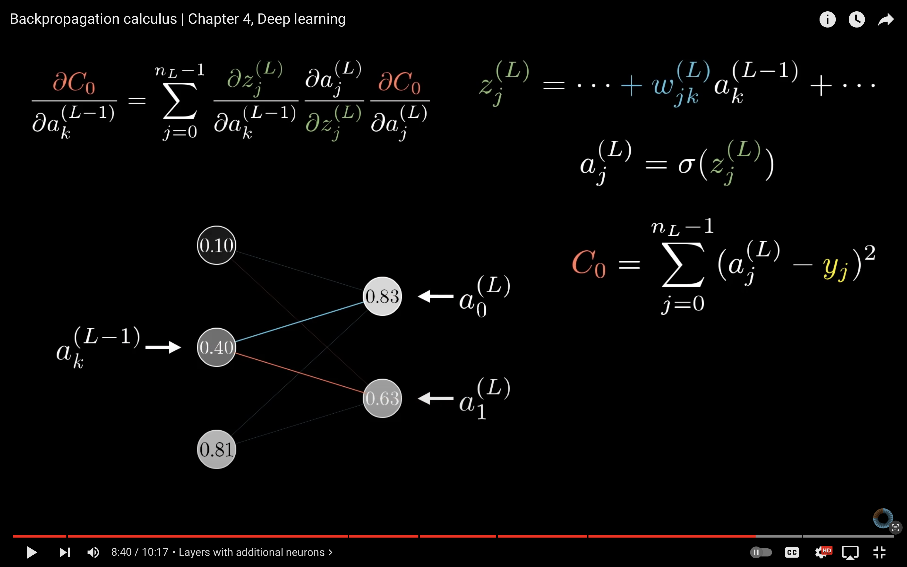

## 第六章

打卡第六章，这一章说了很多实战经验，值得细读。主要说了几个问题：如何更新参数？如何设置参数初始值？如何避免过拟合？一个一个来看。

如何更新参数？

前面说过，深度学习就是梯度下降的过程，反向传播提高了「求梯度」的效率，那么接下来就要说「下降」的事情。「下降」其实就是更新参数的过程，参数的更新由 optimizer 负责完成。我们在这里需要做的只是将参数和梯度的信息传给 optimizer，由它来决定如何更新参数。

SGD 的缺点是如果函数的形状非均向(anisotropic)，比如呈延伸状，搜索的路径就会非常低效。为了改正 SGD 的缺点，书里介绍了 Momentum、AdaGrad、Adam 这 3 种更新参数的方法。 目前并不存在能在所有问题中都表现良好的方法。这 4 种方法各有各的特点，都有各自擅长解决的问题和不擅长解决的问题。

很多深度学习框架都实现了各种 optimizer 方法，比如说 PyTorch 官网里就有关于这些方法文档。（下图）

—

如何设置参数初始值？

参数初始值的设置非常重要，因为这直接决定了学习是否能成功。初始值可以随便你设置，但是也是有讲究的，初始值不能设置为 0，不然无法学习！

偏向 0 和 1 的数据分布会造成反向传播中梯度的值不断变小，最后消失。这个问题称为梯度消失(gradient vanishing)。层次加深的深度学习中，梯度消失的问题可能会更加严重。

如果 100 个神经元都输出几乎相同的值，那么也可以由 1 个神经元来表达基本相同的事情。因此，激活值在分布上有所偏向会出现“表现力受限”的问题。

总结一下，当激活函数使用 ReLU 时，权重初始值使用 He 初始值，当激活函数为 sigmoid 或 tanh 等 S 型曲线函数时，初始值使用 Xavier 初始值。 这是目前的最佳实践。

—

这一章后面的内容等到下次打卡。

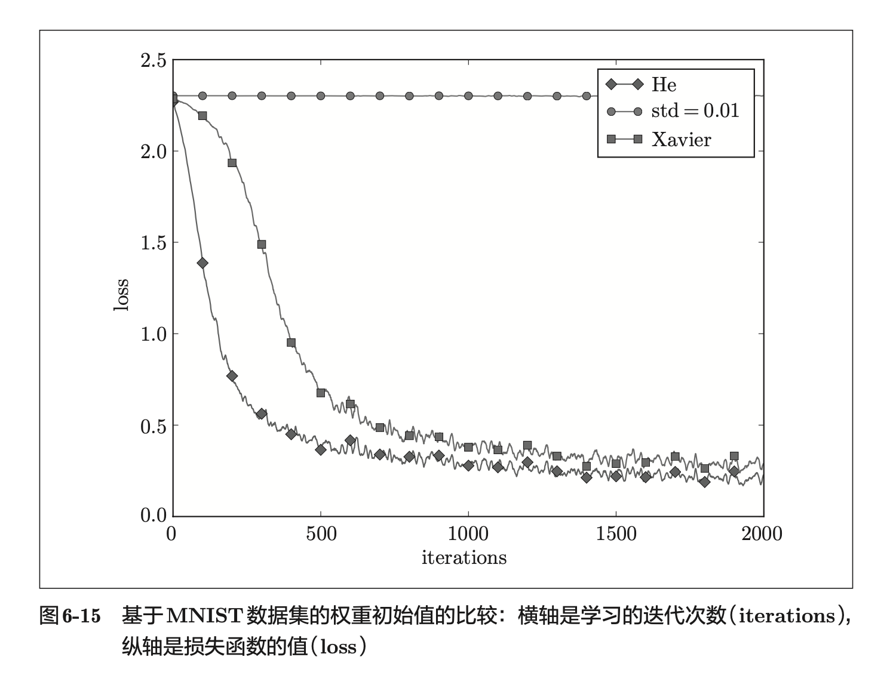

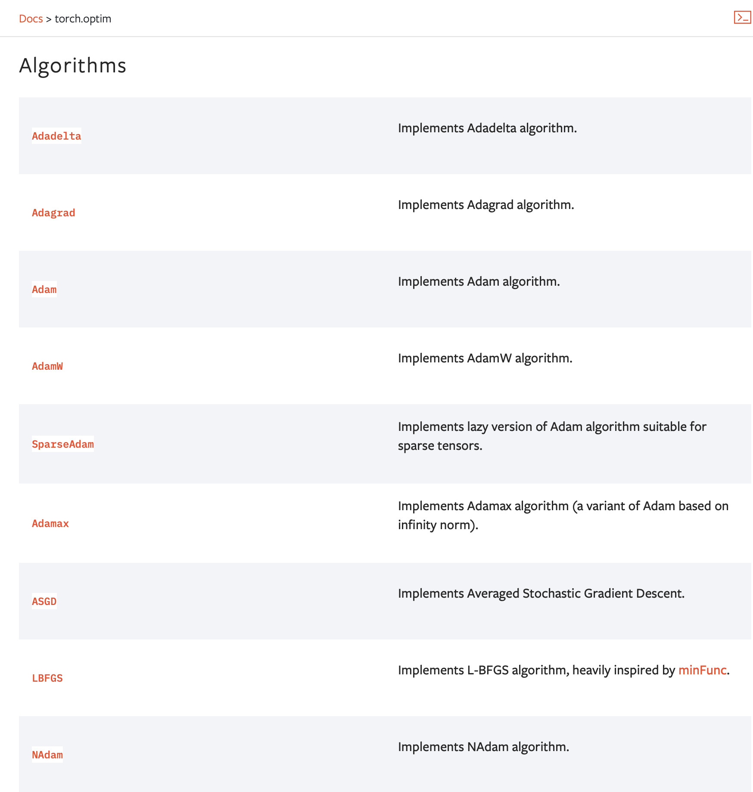

## 继续打卡第六章

通过使用 Batch Normalization（批处理归一化），可以调整激活的分布。Batch Norm 的思路是调整各层的激活值分布使其拥有适当的广度。为此，要向神经网络中插入对数据分布进行正规化的层，即 Batch Normalization 层。Batch Norm 层的反向传播的推导有些复杂，可以自行学习。

防止过拟合？

权值衰减是一直以来经常被使用的一种抑制过拟合的方法。该方法通过在学习的过程中对大的权重进行惩罚，来抑制过拟合。很多过拟合原本就是因为权重参数取值过大才发生的。

Dropout 是一种在学习的过程中随机删除神经元的方法。训练时，随机选出隐藏层的神经元，然后将其删除。被删除的神经元不再进行信号的传递。

超参数的优化

逐渐缩小“好值”存在的范围是搜索超参数的一个有效方法。

这里介绍的超参数的最优化方法是实践性的方法。如果需要更精炼的方法，可以使用贝叶斯最优化(Bayesian optimization)。贝叶斯最优化运用以贝叶斯定理为中心的数学理论，能够更加严密、高效地进行最优化。

参数的更新方法、 权重初始值的赋值方法、Batch Normalization、Dropout 等，这些都是现代神经网络中不可或缺的技术，这些技巧在最先进的深度学习中也被频繁使用。

这一章有很多内容还不够理解，值得后续再研究一番。

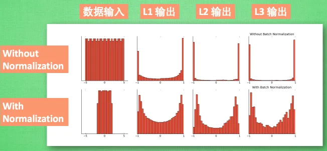

## 打卡第七章——卷积神经网络（CNN）！！！

CNN 非常适合于图像识别、语音识别等场合，这里我要继续推荐 3b1b 的卷积神经网络的视频：https://www.youtube.com/watch?v=KuXjwB4LzSA

CNN 诞生的原因是全连接层(Affine 层) 忽视了数据的形状，但是数据的现状里蕴含了很多数据的特征。比如说图像有三维的数据：长、宽、颜色值。（如图所示）

卷积层可以保持形状不变，所以特别适合用来寻找图像的特征。

CNN 中有时将卷积层的输入输出数据称为特征图(feature map)。

关于 3 维数据卷积的运算，并不是很好理解，除了书本里的描述外，你还可以看这篇文章：https://blog.csdn.net/fu18946764506/article/details/88185434

池化是缩小高、长方向上的空间的运算。 除了 Max 池化之外，还有 Average 池化等。相对于 Max 池化是从目标区域中取出最大值，Average 池化则是计算目标区域的平均值。 在图像识别领域，主要使用 Max 池化。

通过 CNN 的可视化，可以更好地理解 CNN。如下图，第一层的神经元对边缘或斑块有响应，第三层的神经元对纹理有响应，第五层对物体部件有响应，最后的全连接层对物体的类别有响应。

具有代表性的 CNN 有 LeNet 和 AlexNet。LeNet 和 AlexNet 没有太大的不同。但围绕它们的环境和计算机技术有了很大的进步。具体地说，现在任何人都可以获得大量的数据。而且，擅长大规模并行计算的 GPU 得到普及，高速进行大量的运算已经成为可能。大数据和 GPU 已成为深度学习发展的巨大的原动力！

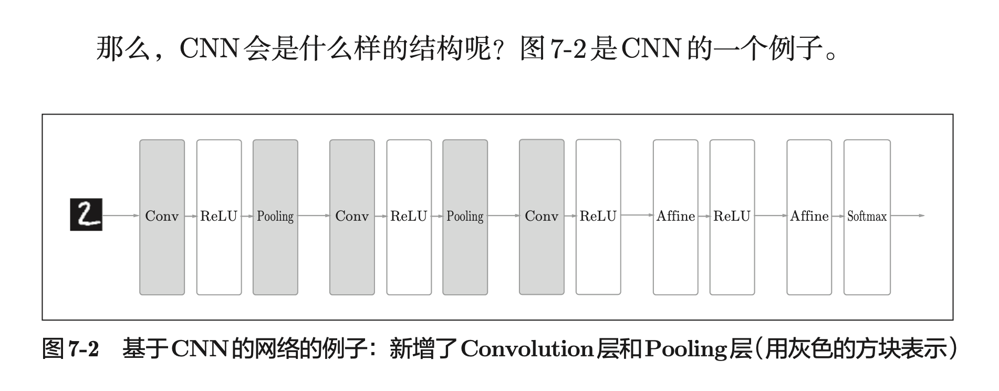

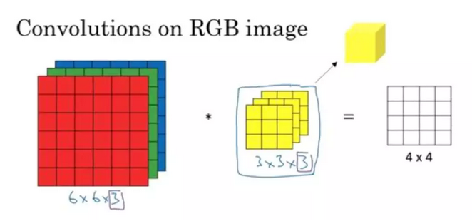

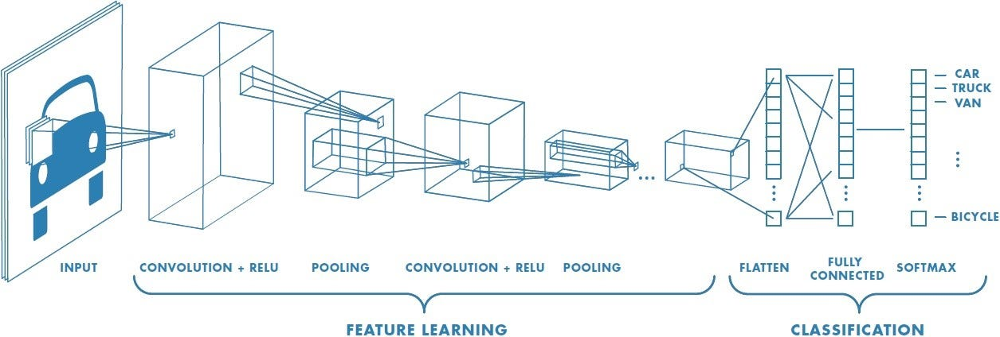

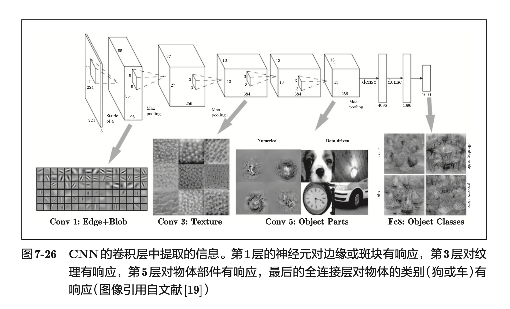

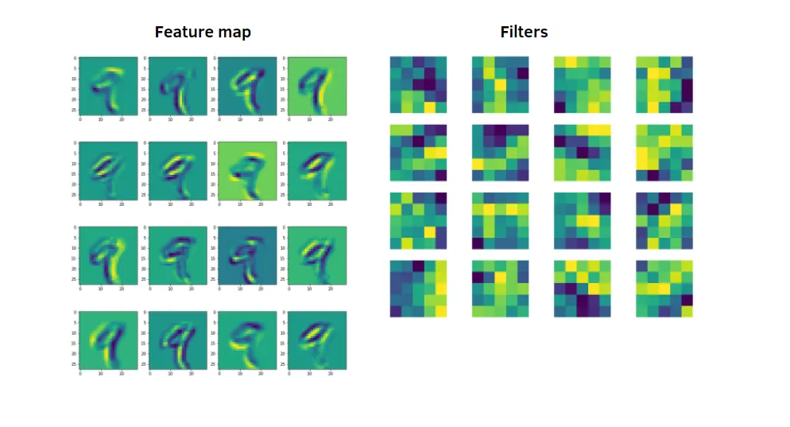
