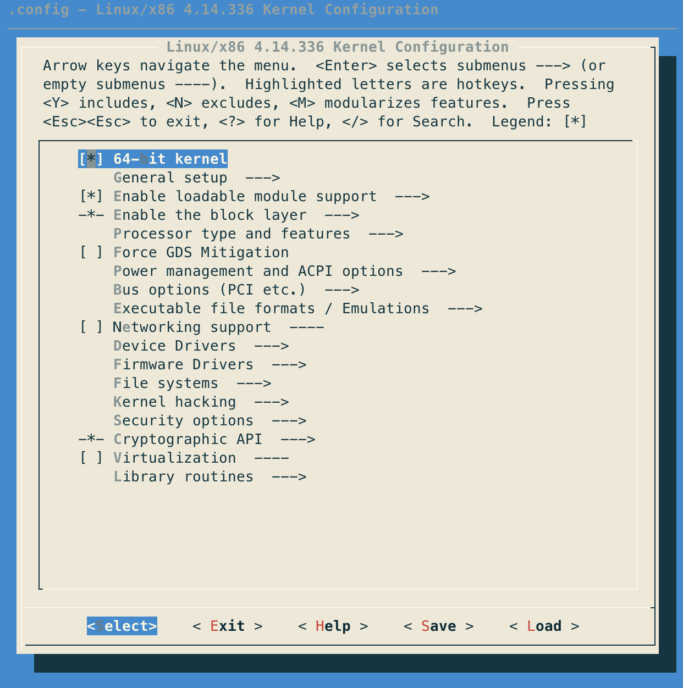

最近在研究 Linux 内核是如何被构建出来的。

## 什么是 kbuild system?

总所周知，Linux 内核可以说是世界最成功的操作系统了，它已经运行在全世界几乎每一个角落。

Linux 内核在很早之前就有上千万行代码，而且贡献者也达到了数千人，如何让这样体量的项目可以顺利地维护下去，是一项不小的挑战。为了解决这个挑战，Linux 内核的开发者们专门开发了一套构建系统，也就他们称之为的 Linux kernel build system，简称 kbuild。这个 kbuild 其实就是各种各样的 makefile，在这些 makefile 的共同工作下完成内核的各种构建工作。

这个话题我们再说远一点。

对于一个大型操作系统项目来说，好的构建系统应该是怎么样的？

-   它应该允许**用户**很灵活地配置哪些代码被编译进内核里；
-   它应该允许**内核开发者**很方便地加入代码而不需要大幅度地调整构建系统；
-   它应该能够最大程度地判断一个构建 target 是否应该被重新构建；

据我的一番探索，我发现 kbuild 其实就实现了上述所有这些点。

Linux kernel 正是有了 kbuild 这样强大的构建系统，它才能很灵活地调整哪些代码应该被编译进内核中，才能编译出适合各种硬件类型的内核，才能让 Linux 占领各种各样的硬件市场。

而且由于 Linux 内核的各个模块之间分割得比较好，所以各种开发者也可以方便地进行开发，这也是 Linux 内核如此成功的原因之一。

---

编译内核是一件非常简单的事情，如果你还没有试过编译运行 Linux Kernel，那么请参考我的另外一篇文章。

编译 Linux 内核一般要经过两个步骤：

-   第一步就是生成构建配置：`make *config`
-   第二步就是构建内核：`make`

我们就从这两个步骤中剖析一下 kbuild 是如何工作的。

（以下代码都来来自于 linux-4.14.336）

## 执行 make menuconfig 会发生什么？

执行这个命令之后，它会在命令行中出现一个配置界面，通过这个配置界面，用户可以勾选各种配置参数，然后点击保存，它就会生成`.config`这个文件，这个文件就是编译整个内核的配置文件。



执行`make menuconfig` 会触发根目录下的`Makefile`里的`%config` 这个 target：

```makefile
%config: scripts_basic outputmakefile FORCE
	$(Q)$(MAKE) $(build)=scripts/kconfig $@
```

它依赖于 scripts_basic 和 outputmakefile 和 FORCE 这三个依赖。

### scripts_basic

```makefile
# Basic helpers built in scripts/basic/
PHONY += scripts_basic
scripts_basic:
	$(Q)$(MAKE) $(build)=scripts/basic
	$(Q)rm -f .tmp_quiet_recordmcount
```

先说结论，`scripts_basic` 这个 target 其实就是编译 `scripts/basic/` 这个目录下的代码，编译出叫做 `fixdep` 和 `bin2c`的可执行文件，这两个小程序在后面的构建工作中会被用到。

### outputmakefile

```makefile
PHONY += outputmakefile
# outputmakefile generates a Makefile in the output directory, if using a
# separate output directory. This allows convenient use of make in the
# output directory.
outputmakefile:
ifneq ($(KBUILD_SRC),)
	$(Q)ln -fsn $(srctree) source
	$(Q)$(CONFIG_SHELL) $(srctree)/scripts/mkmakefile \
	    $(srctree) $(objtree) $(VERSION) $(PATCHLEVEL)
endif
```

通过注释我们可以大致了解这个 target 是做什么的，它其实就是在编译产物的目录里写入 makefile，允许用户在编译产物的目录里可以很方便地使用 make。

这个不是我们分析的关键，我们可以先不用关注。

### 构建并运行 mconf

我们重点来分析下面这关键的一行做了什么：

```makefile
$(Q)$(MAKE) $(build)=scripts/kconfig $@
```

`$(build)` 这个变量是定义在另外一个叫做 `scripts/Kbuild.include` 的 makefile 里的：

```makefile
###
# Shorthand for $(Q)$(MAKE) -f scripts/Makefile.build obj=
# Usage:
# $(Q)$(MAKE) $(build)=dir
build := -f $(srctree)/scripts/Makefile.build obj
```

所以上述那关键的一行展开就是：

```shell
make -f ./script/Makefile.build obj=script/kconfig menuconfig
```

这一行命令就相当于在 makefile 里面再次调用 make，相当于执行 `./script/Makefile.build`，传入的参数是 `obj=script/kconfig`，触发的 target 为 `menuconfig`。

> 组件式构建，称为递归 make，是 GNU make  管理大型项目的常用方法。
>
> kbuild 是递归 make 的一个很好的例子。通过将源文件划分为不同的模块/组件，每个组件都由其自己的 makefile 管理。当你开始构建时，顶级 makefile 以正确的顺序调用每个组件的 makefile、构建组件，并将它们收集到最终的执行程序中。

接下来，我们就到 `./script/Makefile.build` 中一探究竟。

我们发现，这里面并没有一个叫做 `menuconfig` 的 target 啊？为什么它还可以执行下去？

其实它使用了 `include` 指令来导入 `script/kconfig/` 目录下的 makefile，这个里面就包含了 `menuconfig` 这个 target。

这就是为什么它要传入一个 obj 参数的原因，这个 obj 就是告诉 `./script/Makefile.build` 应该 `include` 哪个 makefile。

具体的 `include` 的代码在这里：

```makefile
# The filename Kbuild has precedence over Makefile
kbuild-dir := $(if $(filter /%,$(src)),$(src),$(srctree)/$(src))
kbuild-file := $(if $(wildcard $(kbuild-dir)/Kbuild),$(kbuild-dir)/Kbuild,$(kbuild-dir)/Makefile)
include $(kbuild-file)
```

于是它就会触发`script/kconfig/Makefile`里的 `menuconfig` 的 target：

```makefile
menuconfig: $(obj)/mconf
	$< $(silent) $(Kconfig)
```

这个 target 只做了两件事情：第一，构建出 `$(obj)/mconf` 这个二进制文件；第二， `$< $(silent) $(Kconfig)`，执行 `mconf` 这个二进制文件，参数为 `$(Kconfig)`。

这里的 `mconf` 二进制文件就是打开配置界面的那个程序，就是文章上面第一个图。

它主要负责收集配置，然后提供一个配置界面，接收用户的交互，最终产生 `.config`文件。

我们继续说说这个 `mconf` 的工作细节，这有助于我们理解 kbuild 的工作方式。开始之前，我们有几个疑惑：

-   `mconf` 里的这些配置项是哪里来的？
-   当我保存之后，生成的 `.config` 文件里有什么？
-   `.config` 文件会如何被 kbuild 使用？

第一个问题，这些配置项是定义在各处的 Kconfig 文件里的，用的是一种 kbuild 专属的配置语言。

mconf 的任务就是读取根目录的 Kconfig 文件，而这个 Kconfig 文件自己也会把各处的 kconfig 文件给 include 进来。

然后 mconf 还会读取各处已经存在的配置信息，比如说之前执行过配置产生的 `.config` 文件，等等。

然后就是渲染出图形界面，接受用户的交互，最后保存，产生一个新的 `.config` 文件。

### mconf 的工作细节

所有相关的代码都在 `scripts/kconfig/` 路径下。

## 执行 make 会发生什么？

上面我们说了，构建内核的最后一步就是直接运行 `make`，它会构建出我们想要的内核。

我们知道，当我们运行 `make` 的时候，它会默认触发第一个出现的 target 或者名字叫做 all 的 target，如下：

```makefile
# That's our default target when none is given on the command line
PHONY := _all
_all:

# ===========================================================================
# Build targets only - this includes vmlinux, arch specific targets, clean
# targets and others. In general all targets except *config targets.

# If building an external module we do not care about the all: rule
# but instead _all depend on modules
PHONY += all
ifeq ($(KBUILD_EXTMOD),)
_all: all
else
_all: modules
endif

# The all: target is the default when no target is given on the
# command line.
# This allow a user to issue only 'make' to build a kernel including modules
# Defaults to vmlinux, but the arch makefile usually adds further targets
all: vmlinux

# Build modules
#
# A module can be listed more than once in obj-m resulting in
# duplicate lines in modules.order files.  Those are removed
# using awk while concatenating to the final file.

PHONY += modules
modules: $(vmlinux-dirs) $(if $(KBUILD_BUILTIN),vmlinux) modules.builtin
	$(Q)$(AWK) '!x[$$0]++' $(vmlinux-dirs:%=$(objtree)/%/modules.order) > $(objtree)/modules.order
	@$(kecho) '  Building modules, stage 2.';
	$(Q)$(MAKE) -f $(srctree)/scripts/Makefile.modpost
```

所以，它会触发一个叫`_all` 的 target，它会根据参数 `$(KBUILD_EXTMOD)` 分为两种情况，一种是 `all`，一种是 `modules`，我们现在先把注意力放到 `all: vmlinux` 上，因为这里的 `vmlinux` 就是我们编译内核的 target。

<!-- > Linux 内核小知识：vmlinux，vmlinuz，vmlinux.bin，zimage，bzimage 分别是什么？
>
> vmlinux 是没有压缩过也不 bootable 的内核镜像，这个是构建 vmlinuz 的中间产物。
>
> vmlinuz 是压缩过而且 bootable 的内核镜像。
>
> vmlinux.bin
>
> zimage
>
> bzImage 就是我们最终获取的，可以直接在机器上运行的内核。
>
> 可以参考这篇文章：[Differences Between vmlinux, vmlinuz, vmlinux.bin, zimage, and bzimage](https://www.baeldung.com/linux/kernel-images) -->

接下来，我把 `vmlinux` 这个 target 相关的内容都摘录过来，我们一起看看都包含了哪些内容：

```makefile
vmlinux: scripts/link-vmlinux.sh vmlinux_prereq $(vmlinux-deps) FORCE
	+$(call if_changed,link-vmlinux)

PHONY += vmlinux_prereq
vmlinux_prereq: $(vmlinux-deps) FORCE
ifdef CONFIG_HEADERS_CHECK
	$(Q)$(MAKE) -f $(srctree)/Makefile headers_check
endif

vmlinux-deps := $(KBUILD_LDS) $(KBUILD_VMLINUX_INIT) $(KBUILD_VMLINUX_MAIN) $(KBUILD_VMLINUX_LIBS)

# The actual objects are generated when descending,
# make sure no implicit rule kicks in
$(sort $(vmlinux-deps)): $(vmlinux-dirs) ;

PHONY += $(vmlinux-dirs)
$(vmlinux-dirs): prepare scripts
	$(Q)$(MAKE) $(build)=$@

vmlinux-dirs	:= $(patsubst %/,%,$(filter %/, $(init-y) $(init-m) \
		     $(core-y) $(core-m) $(drivers-y) $(drivers-m) \
		     $(net-y) $(net-m) $(libs-y) $(libs-m) $(virt-y)))

export KBUILD_VMLINUX_INIT := $(head-y) $(init-y)
export KBUILD_VMLINUX_MAIN := $(core-y) $(libs-y2) $(drivers-y) $(net-y) $(virt-y)
export KBUILD_VMLINUX_LIBS := $(libs-y1)
export KBUILD_LDS          := arch/$(SRCARCH)/kernel/vmlinux.lds
```

`vmlinux`依赖于`scripts/link-vmlinux.sh` 和 `vmlinux_prereq` 和`$(vmlinux-deps)`，我们重点来关注 `$(vmlinux-deps)` 的构建。

我们可以看到，`vmlinux-deps` 实际上有四大依赖，分别是：

-   `$(KBUILD_LDS)`
-   `$(KBUILD_VMLINUX_INIT)`
-   `$(KBUILD_VMLINUX_MAIN)`
-   `$(KBUILD_VMLINUX_LIBS)`

这里先说结论，假设我们的内核的目标是运行在 `x86` 架构上，那么经过一系列的变量赋值和函数操作后：

`$(KBUILD_LDS)` 的值为 `arch/$(SRCARCH)/kernel/vmlinux.lds`，这里的`$(SRCARCH)` 就是我们在构建配置里指定的 CPU 架构，这里就是 `x86`；

`$(KBUILD_VMLINUX_INIT)` 的值展开为：

```
arch/x86/kernel/head_64.o arch/x86/kernel/head64.o arch/x86/kernel/ebda.o arch/x86/kernel/platform-quirks.o
init/built-in.o
```

`$(KBUILD_VMLINUX_MAIN)` 的值展开为：

```
usr/built-in.o arch/x86/built-in.o kernel/built-in.o certs/built-in.o mm/built-in.o
fs/built-in.o ipc/built-in.o security/built-in.o crypto/built-in.o block/built-in.o lib/built-in.o arch/x86/lib/built-in.o drivers/built-in.o sound/built-in.o
firmware/built-in.o arch/x86/pci/built-in.o arch/x86/power/built-in.o arch/x86/video/built-in.o net/built-in.o virt/built-in.o
```

`$(KBUILD_VMLINUX_LIBS)` 的值为：

```
lib/lib.a arch/x86/lib/lib.a
```

`vmlinux-dirs`的值为：

```
init usr arch/x86 kernel certs mm fs ipc security crypto block drivers sound firmware arch/x86/pci arch/x86/power arch/x86/video net lib arch/x86/lib virt
```

`vmlinux-dirs`实际上就是要参与构建内核的代码的目录。

`vmlinux-deps` 的值为：

```
arch/x86/kernel/vmlinux.lds arch/x86/kernel/head_64.o arch/x86/kernel/head64.o arch/x86/kernel/ebda.o arch/x86/kernel/platform-quirks.o
init/built-in.o usr/built-in.o arch/x86/built-in.o kernel/built-in.o certs/built-in.o mm/built-in.o
fs/built-in.o ipc/built-in.o security/built-in.o crypto/built-in.o block/built-in.olib/built-in.o arch/x86/lib/built-in.o drivers/built-in.o sound/built-in.o
firmware/built-in.o arch/x86/pci/built-in.o arch/x86/power/built-in.o arch/x86/video/built-in.o net/built-in.o virt/built-in.o lib/lib.a arch/x86/lib/lib.a
```

实际上，每一个参与构建的目录下面都会最终产生一个叫做 `built-in.o` 的产物，kbuild 会通过链接脚本 `arch/x86/kernel/vmlinux.lds` 把这些 `.o` 和 `lib.a` 链接在一起，最终产生 `vmlinux`。

对于上述内容，我画了一个图，来帮助读者更好地理解：

```
                        +-----------------------+
         +--------------|          $(KBUILD_LD) |<-------------------- arch/$(SRCARCH)/kernel/vmlinux.lds   ---------
         |              +-----------------------+                                                                    \
         |                                                                                                            \
         |                                                                                                             \
         |                                                             arch/x86/kernel/head_64.o                        |
         |              +-----------------------+<----- $(head-y)<---- arch/x86/kernel/head64.o                         |
         |              |                       |                      arch/x86/kernel/ebda.o                           |
         |     +--------+$(KBUILD_VMLINUX_INIT) |                      arch/x86/kernel/platform-quirks.o                |
         |     |        |                       |                                                                       |
         v     v        +-----------------------+<----- $(init-y)<---- init/built-in.o                                  |
+------------------+                                                                                                    |
|                  |                                                                                                    |
|       .--.       |                                                                                                    |
|      |o_o |      |                                                   usr/built-in.o                                   |
|      |:_/ |      |                                                   arch/x86/built-in.o                              |
|     //   \ \     |                                                   kernel/built-in.o                                |
|    (|     | )    |                                                   certs/built-in.o                                 |
|    /'\_   _/`\   |                                                   mm/built-in.o
|    \___)=(___/   |   +------------------------+<----- $(core-y)<---- fs/built-in.o                               $(vmlinux-deps)
|                  |   |                        |                      ipc/built-in.o
|     vmlinux      |   |                        |                      security/built-in.o                              |
|                  |   |                        |                      crypto/built-in.o                                |
|     4.14.336     |   |                        |                      block/built-in.o                                 |
+--------+---------+   |                        |                                                                       |
         |     ^       |                        |                      arch/x86/lib/built-in.o                          |
         |     |       |                        |<--- $(libs-y2) <---- lib/built-in.o                                   |
         |     +-------+ $(KBUILD_VMLINUX_MAIN) |                                                                       |
         |             |                        |                      drivers/built-in.o   arch/x86/pci/built-in.o     |
         |             |                        |<- $(drivers-y) <---- sound/built-in.o     arch/x86/power/built-in.o   |
         |             |                        |                      firmware/built-in.o  arch/x86/video/built-in.o   |
         |             |                        |                                                                       |
         |             |                        |<----- $(net-y) <---- net/built-in.o                                   |
         |             |                        |                                                                       |
         |             +------------------------+<---- $(virt-y) <---- virt/built-in.o                                  |
         |                                                                                                              |
         |                                                                                                             /
         |                                                                                                            /
         |             +------------------------+                      lib/lib.a                                     /
         +-------------+ $(KBUILD_VMLINUX_LIBS) |<--- $(libs-y1) <---- arch/x86/lib/ib.a   --------------------------
                       +------------------------+
```

接下来，我们只要知道这些 build-in.o 是怎么被构建出来的，那么我们就知道内核是如何被构建出来的了。

### 构建 built-in.o

下面我们来看看这些 `built-in.o` 是如何被构建出来的，主要看这部分的代码：

```makefile
PHONY += $(vmlinux-dirs)
$(vmlinux-dirs): prepare scripts
	$(Q)$(MAKE) $(build)=$@
```

这里就要谈到 make 的一个特性了，像 `$(vmlinux-dirs)` 这样的变量其实是多个目录用空格连起来的字符串，那么 make 在执行这个目标的时候，它会循环把每一个目录给取出来，然后执行这个目标。

说白了，就是每个参与构建的目录都会触发这个 target 每一次都会执行命令 `$(Q)$(MAKE) $(build)=$@`。

以 `init` 为例，那么这个命令展开就是：

```shell
make -f ./script/Makefile.build obj=init
```

这个形式的命令我们很熟悉了，就是去执行 `./script/Makefile.build`，参数为 `obj=init`。

我们来看看这个 `./script/Makefile.build`，因为我们的命令没有指定任何 target，所以就触发默认的 target，也就是这个 `__build`：

```makefile
# Init all relevant variables used in kbuild files so
# 1) they have correct type
# 2) they do not inherit any value from the environment
obj-y :=
obj-m :=
lib-y :=
lib-m :=
always :=
targets :=
subdir-y :=
subdir-m :=
EXTRA_AFLAGS   :=
EXTRA_CFLAGS   :=
EXTRA_CPPFLAGS :=
EXTRA_LDFLAGS  :=
asflags-y  :=
ccflags-y  :=
cppflags-y :=
ldflags-y  :=

__build: $(if $(KBUILD_BUILTIN),$(builtin-target) $(lib-target) $(extra-y)) \
	 $(if $(KBUILD_MODULES),$(obj-m) $(modorder-target)) \
	 $(subdir-ym) $(always)
	@:
```

当然，在这之前，已经把`init/Makefile`给 include 进来了，这个`init/Makefile` 里会给 `obj-y`和`obj-m`和`lib-y`和`lib-m`和`always`和`extra-y` 这些变量赋予具体的值。

`obj-y` 的值都是 `xxx.o yyy.o zzz.o` 这样的形式，于是乎，这个`__build`target 就会执行这些依赖：

```
$(builtin-target)
$(lib-target)
$(extra-y)
$(obj-m)
$(modorder-target)
$(subdir-ym)
$(always)
```

我们只讨论一个`$(builtin-target)`，其他的都差不多，读者可以自行推导。

`$(builtin-target)` 可以展开为：

```makefile
ifneq ($(strip $(obj-y) $(obj-m) $(obj-) $(subdir-m) $(lib-target)),)
builtin-target := $(obj)/built-in.o
endif

$(builtin-target): $(obj-y) FORCE
	$(call if_changed,link_o_target)
```

在这里它就等于 `init/built-in.o`，要生成它，则需要依赖于 `$(obj-y)`，而我们上面说了，`$(obj-y)` 实际上就是 `init` 目录下的 Makefile 里赋值好的：

```makefile
# SPDX-License-Identifier: GPL-2.0
#
# Makefile for the linux kernel.
#

ccflags-y := -fno-function-sections -fno-data-sections

obj-y                          := main.o version.o mounts.o
ifneq ($(CONFIG_BLK_DEV_INITRD),y)
obj-y                          += noinitramfs.o
else
obj-$(CONFIG_BLK_DEV_INITRD)   += initramfs.o
endif
obj-$(CONFIG_GENERIC_CALIBRATE_DELAY) += calibrate.o

ifneq ($(CONFIG_ARCH_INIT_TASK),y)
obj-y                          += init_task.o
endif

mounts-y			:= do_mounts.o
mounts-$(CONFIG_BLK_DEV_RAM)	+= do_mounts_rd.o
mounts-$(CONFIG_BLK_DEV_INITRD)	+= do_mounts_initrd.o
mounts-$(CONFIG_BLK_DEV_MD)	+= do_mounts_md.o

# dependencies on generated files need to be listed explicitly
$(obj)/version.o: include/generated/compile.h

# compile.h changes depending on hostname, generation number, etc,
# so we regenerate it always.
# mkcompile_h will make sure to only update the
# actual file if its content has changed.

       chk_compile.h = :
 quiet_chk_compile.h = echo '  CHK     $@'
silent_chk_compile.h = :
include/generated/compile.h: FORCE
	@$($(quiet)chk_compile.h)
	$(Q)$(CONFIG_SHELL) $(srctree)/scripts/mkcompile_h $@ \
	"$(UTS_MACHINE)" "$(CONFIG_SMP)" "$(CONFIG_PREEMPT)" "$(CC) $(KBUILD_CFLAGS)"

```

如果你在 `.config ` 里配置好了 `CONFIG_ARCH_INIT_TASK=y`，那么在这里的 `obj-y` 变量里就包含 `init_task.o` 这个构建目标，而且这个目标是要被构建进内核的。

这样，你就知道我们在第一个步骤里创建的 `.config ` 是如何影响到这些代码是否被编译进内核的。

接下来就是看 `obj-y` 这一堆的 `.o` 文件是如何被构建出来的了。

当需要构建任何一个 `.o` 文件的时候，make 发现找不到目标，那么 make 就会去通配符匹配，通过下面的代码，可以看到它匹配到了 `$(obj)/%.o` 这个 target，这个就是构建出这些 `.o` 文件的地方。

它所做的事情非常简单，就是去寻找名字一样的 `.c` 或 `.S` 文件作为源文件，然后构建出 `.o`文件：

```makefile
# Usage: $(call if_changed_rule,foo)
# Will check if $(cmd_foo) or any of the prerequisites changed,
# and if so will execute $(rule_foo).
if_changed_rule = $(if $(strip $(any-prereq) $(arg-check) ),                 \
	@set -e;                                                             \
	$(rule_$(1)), @:)

define rule_cc_o_c
	$(call echo-cmd,checksrc) $(cmd_checksrc)			  \
	$(call cmd_and_fixdep,cc_o_c)					  \
	$(call echo-cmd,objtool) $(cmd_objtool)				  \
	$(cmd_modversions_c)						  \
	$(call echo-cmd,record_mcount) $(cmd_record_mcount)
endef

# Built-in and composite module parts
$(obj)/%.o: $(src)/%.c $(recordmcount_source) $(objtool_dep) FORCE
	$(call cmd,force_checksrc)
	$(call if_changed_rule,cc_o_c)

$(obj)/%.o: $(src)/%.S $(objtool_dep) FORCE
	$(call if_changed_rule,as_o_S)
```

最终，kbuild 会把同一个目录下产生的一堆 `.o` 文件合并为一个 `built-in.o` 文件：

```makefile
#
# Rule to compile a set of .o files into one .o file
#
ifdef builtin-target

ifdef CONFIG_THIN_ARCHIVES
  cmd_make_builtin = rm -f $@; $(AR) rcSTP$(KBUILD_ARFLAGS)
  cmd_make_empty_builtin = rm -f $@; $(AR) rcSTP$(KBUILD_ARFLAGS)
  quiet_cmd_link_o_target = AR      $@
else
  cmd_make_builtin = $(LD) $(ld_flags) -r -o
  cmd_make_empty_builtin = rm -f $@; $(AR) rcs$(KBUILD_ARFLAGS)
  quiet_cmd_link_o_target = LD      $@
endif

# If the list of objects to link is empty, just create an empty built-in.o
cmd_link_o_target = $(if $(strip $(obj-y)),\
		      $(cmd_make_builtin) $@ $(filter $(obj-y), $^) \
		      $(cmd_secanalysis),\
		      $(cmd_make_empty_builtin) $@)

$(builtin-target): $(obj-y) FORCE
	$(call if_changed,link_o_target)

targets += $(builtin-target)
endif # builtin-target
```

### 链接内核

当我们走到这一步时，我们已经有了一大堆的 `built-in.o` 和 `lib.a` 文件，接下来就是把这些文件链接到一起，生成最终的产物 `vmlinux`。

这一行就是在链接内核：`+$(call if_changed,link-vmlinux)`

从下面这些代码可以看出，它最终会调用函数`cmd_link-vmlinux`，它会做两件事情：

-   链接内核
-   如果`ARCH_POSTLINK`存在，那么再走 arch pass

`cmd_link-vmlinux` 函数中的 `$<` 实际上就是 `scripts/link-vmlinux.sh`， `$@` 实际上就是 `vmlinux`。

所以第一行展开就是执行这个脚本，参数是后面三个，就是 `/bin/bash scripts/link-vmlinux.sh ld`，`$(LDFLAGS)` 和 `$(LDFLAGS_vmlinux)` 都为空。

```makefile
vmlinux: scripts/link-vmlinux.sh vmlinux_prereq $(vmlinux-deps) FORCE
	+$(call if_changed,link-vmlinux)

# Final link of vmlinux with optional arch pass after final link
cmd_link-vmlinux =                                                 \
	$(CONFIG_SHELL) $< $(LD) $(LDFLAGS) $(LDFLAGS_vmlinux) ;    \
	$(if $(ARCH_POSTLINK), $(MAKE) -f $(ARCH_POSTLINK) $@, true)

# Execute command if command has changed or prerequisite(s) are updated.
if_changed = $(if $(strip $(any-prereq) $(arg-check)),                       \
	@set -e;                                                             \
	$(echo-cmd) $(cmd_$(1));                                             \
	printf '%s\n' 'cmd_$@ := $(make-cmd)' > $(dot-target).cmd, @:)
```

接下来就是看看 `scripts/link-vmlinux.sh` 这个文件里是啥逻辑，因为这个 shell 脚本是由 make 所启动的，所以在这个 shell 脚本里是可以读取 makefile 里定义的各种变量的，比如说这几个：`$(KBUILD_LDS)`、`$(KBUILD_VMLINUX_INIT)`、`$(KBUILD_VMLINUX_MAIN)`、`$(KBUILD_VMLINUX_LIBS)`。

我尝试摘录一些重要的代码：

```shell
#!/bin/sh
# SPDX-License-Identifier: GPL-2.0
#
# link vmlinux
#
# vmlinux is linked from the objects selected by $(KBUILD_VMLINUX_INIT) and
# $(KBUILD_VMLINUX_MAIN) and $(KBUILD_VMLINUX_LIBS). Most are built-in.o files
# from top-level directories in the kernel tree, others are specified in
# arch/$(ARCH)/Makefile. Ordering when linking is important, and
# $(KBUILD_VMLINUX_INIT) must be first. $(KBUILD_VMLINUX_LIBS) are archives
# which are linked conditionally (not within --whole-archive), and do not
# require symbol indexes added.
#
# vmlinux
#   ^
#   |
#   +-< $(KBUILD_VMLINUX_INIT)
#   |   +--< init/version.o + more
#   |
#   +--< $(KBUILD_VMLINUX_MAIN)
#   |    +--< drivers/built-in.o mm/built-in.o + more
#   |
#   +--< $(KBUILD_VMLINUX_LIBS)
#   |    +--< lib/lib.a + more
#   |
#   +-< ${kallsymso} (see description in KALLSYMS section)
#
# vmlinux version (uname -v) cannot be updated during normal
# descending-into-subdirs phase since we do not yet know if we need to
# update vmlinux.
# Therefore this step is delayed until just before final link of vmlinux.
#
# System.map is generated to document addresses of all kernel symbols

# Link of vmlinux
# ${1} - optional extra .o files
# ${2} - output file
vmlinux_link()
{
	local lds="${objtree}/${KBUILD_LDS}"
	local objects

	if [ "${SRCARCH}" != "um" ]; then
		if [ -n "${CONFIG_THIN_ARCHIVES}" ]; then
			objects="--whole-archive			\
				built-in.o				\
				--no-whole-archive			\
				--start-group				\
				${KBUILD_VMLINUX_LIBS}			\
				--end-group				\
				${1}"
		else
			objects="${KBUILD_VMLINUX_INIT}			\
				--start-group				\
				${KBUILD_VMLINUX_MAIN}			\
				${KBUILD_VMLINUX_LIBS}			\
				--end-group				\
				${1}"
		fi

		${LD} ${LDFLAGS} ${LDFLAGS_vmlinux} -o ${2}		\
			-T ${lds} ${objects}
	else
		if [ -n "${CONFIG_THIN_ARCHIVES}" ]; then
			objects="-Wl,--whole-archive			\
				built-in.o				\
				-Wl,--no-whole-archive			\
				-Wl,--start-group			\
				${KBUILD_VMLINUX_LIBS}			\
				-Wl,--end-group				\
				${1}"
		else
			objects="${KBUILD_VMLINUX_INIT}			\
				-Wl,--start-group			\
				${KBUILD_VMLINUX_MAIN}			\
				${KBUILD_VMLINUX_LIBS}			\
				-Wl,--end-group				\
				${1}"
		fi

		${CC} ${CFLAGS_vmlinux} -o ${2}				\
			-Wl,-T,${lds}					\
			${objects}					\
			-lutil -lrt -lpthread
		rm -f linux
	fi
}
```

其实从这脚本最上面的注释我们就可以很清楚地知道，`$(KBUILD_VMLINUX_INIT)`、`$(KBUILD_VMLINUX_MAIN)`、`$(KBUILD_VMLINUX_LIBS)`、`${kallsymso}`这几个会按照顺序被链接进 vmlinux 中。

于是我们就获得了一个 `vmlinux`，但是注意，这个还不是最终我们可以运行的迹象，因为我们还没有把 bootloader 加进去，而且也没有进行压缩操作，镜像的体积非常大。

## 依赖追踪

<!-- TODO：fixdep 的细节 -->

文章最开头说了，一个好的构建系统必定是要高效的，一定是可以最大程度避免重复编译的。

先思考一个问题，什么时候某个 `.o` 文件需要被重新编译。

1. 构建这个 `.o` 的代码文件 `.c` 和 `.h` 文件发生变动时；
2. `.config` 配置文件发生变动时，也就是说 `CONFIG_` 变量发生变化时；
3. 构建命令发生变动时；

如何理解这三点？

第一点非常好理解，这种情况下肯定要重新编译，而且 make 会自动查看依赖文件的修改时间来判断是否需要重新编译；

第二点也很好理解，如果我突然不想把某个驱动链接进内核中，那么我会修改 `.config` 文件，那么相关的构建和链接都要重新执行；

第三点，每一次的构建都可能会附带一些参数，比如说 gcc 的编译参数，如果这些参数发生变化了，那么这条构建命令肯定也要重新执行。

后面两点则是由 kbuild 通过一定的机制来实现的。

-   `fixdep`：The secret behind this is that fixdep will parse the depfile (.d file), then parse all the dependency files inside, search the text for all the CONFIG\_ strings, convert them to the corresponding empty header file, and add them to the target's prerequisites. Every time the configuration changes, the corresponding empty header file will be updated, too, so kbuild can detect that change and rebuild the target that depends on it. Because the command line is also recorded, it is easy to compare the last and current compiling parameters.
-   `.cmd` 文件和 `if_changed` 函数：当调用 `if_changed` 函数的时候，它会判断该命令的参数是否发生变化，如果发生了变化，那么就执行该命令，并且把命令记录在 `.cmd` 文件中，当下一次再调用这个函数的时候，它就会先读取该文件来判断命令是否发生改变。

具体的工作原理等我过几天再详细聊聊。

## 从 kbuild 中，我们可以学习到什么？

把整个 kbuild 研究下来之后，我们会学到几点：

-   用原生的 make 也可以管理现代大型项目，不一定非要用 cmake 这类工具；
-   递归 make 非常适合用来管理大型项目，每个目录下的 makefile 只需要管该目录下的构建逻辑，通过这种方式可以把构建系统的逻辑分离地很好，开发者也就可以很方便地贡献代码了；
-   好的构建系统对于一个软件项目的成功来说是必不可少的。

## 参考文献

-   [Kernel Build System](https://docs.kernel.org/kbuild/kbuild.html)
-   [Makefile Tutorial](https://makefiletutorial.com/)
-   [Differences Between vmlinux, vmlinuz, vmlinux.bin, zimage, and bzimage](https://www.baeldung.com/linux/kernel-images)
-   [Exploring the Linux kernel: The secrets of Kconfig/kbuild](https://opensource.com/article/18/10/kbuild-and-kconfig)
