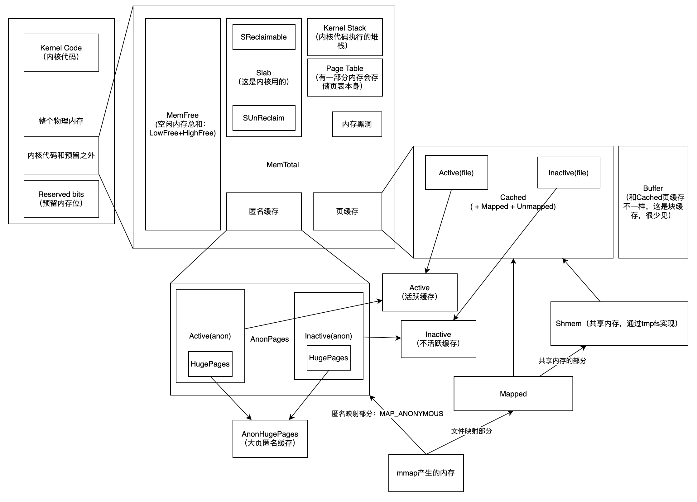

这篇文章我主要来谈谈 Linux 中各种内存指标之间的关系，我在下面画了一个简单的关系图。

正如标题所示，这是一篇 work-in-progress 的文章，也就意味：

-   有很多地方需要补充的地方，比如说 swap 和内存回收的部分；
-   有些地方没有足够的铺垫，比如说 cgroup、cadvisor、mmap 等；
-   有些地方排版不好看，后续还需要调整；
-   还没有来得及很详细地核对，请在阅读本文的时候保持怀疑；

**注意：以下我们都先忽略 swap**

## free 命令

free 命令用来展示总共的、使用掉的、未被使用的物理内存和 swap 内存的大小，以及被内核所使用的 buffer 和 cache 内存的大小。这些信息都是从 `/proc/meminfo` 中收集而来的。

执行 free 命令，会输出：

```
              total        used        free      shared  buff/cache   available
Mem:      115343360    81353072       46324           0    33943964    33990288
Swap:             0           0           0
```

执行 free -h 可以输出人类可读的格式，：

```

              total        used        free      shared  buff/cache   available
Mem:           110G         77G         45M          0B         32G         32G
Swap:            0B          0B          0B
```

-   `Mem` 表示物理内存，Swap 表示 swap 区（swap 文件）的内存。
-   `total` 所有内存 (MemTotal and SwapTotal in `/proc/meminfo`)
-   `used` 使用掉的内存，等于 total - free - buffers - cache
-   `free` 未被使用的内存 (MemFree and SwapFree in `/proc/meminfo`)
-   `shared` 进程间共享内存，绝大部分都是 tmpfs，因为其他进程可以访问 tmpfs 驻留在内存中区域，所以这部分也属于共享内存。(Shmem in /proc/meminfo, kernels 2.6.32 以上支持, 如果不支持就展示为 0。)
-   `buff/cache` 等于 buffer + cache，这部分都是内核使用掉的内存。
    -   buff 内核缓存 (Buffers in `/proc/meminfo`)
    -   cache 页缓存 + slab (Cached and Slab in `/proc/meminfo`)
        -   page cache 就是页缓存；
        -   slab 是 slab allocator 分配给内存，这部分内存是给内核使用的；
-   `available` 估计启动一个新应用所能用的内存大小，这个大小不包含 swap 的区域，等于 free + buff + cache。这是大概的估计值，因为 cache 不可能都被释放掉给该应用使用，只有部分可以释放掉。(MemAvailable in /proc/meminfo, kernels 3.14 以上支持，kernels 2.6.27+ 中模拟出该数值，其他版本下则该值和 free 相等。)

## /proc/meminfo 详解

我的 linux 版本：`uname: Linux wgv-opsk8smanager-02 3.10.0-514.26.2.el7.x86_64 #1 SMP Tue Jul 4 13:29:22 UTC 2017 x86_64 x86_64 x86_64 GNU/Linux`

`cat /proc/meminfo` 可以查出当前各种内存指标，这里面指标非常多。

我查看官方文档的说明，如下：

```
Provides information about distribution and utilization of memory. This varies by architecture and compile options. The following is from a 16GB PIII, which has highmem enabled. You may not have all of these fields.
MemTotal:     16344972 kB
MemFree:      13634064 kB
MemAvailable: 14836172 kB
Buffers:          3656 kB
Cached:        1195708 kB
SwapCached:          0 kB
Active:         891636 kB
Inactive:      1077224 kB
HighTotal:    15597528 kB
HighFree:     13629632 kB
LowTotal:       747444 kB
LowFree:          4432 kB
SwapTotal:           0 kB
SwapFree:            0 kB
Dirty:             968 kB
Writeback:           0 kB
AnonPages:      861800 kB
Mapped:         280372 kB
Shmem:             644 kB
KReclaimable:   168048 kB
Slab:           284364 kB
SReclaimable:   159856 kB
SUnreclaim:     124508 kB
PageTables:      24448 kB
NFS_Unstable:        0 kB
Bounce:              0 kB
WritebackTmp:        0 kB
CommitLimit:   7669796 kB
Committed_AS:   100056 kB
VmallocTotal:   112216 kB
VmallocUsed:       428 kB
VmallocChunk:   111088 kB
Percpu:          62080 kB
HardwareCorrupted:   0 kB
AnonHugePages:   49152 kB
ShmemHugePages:      0 kB
ShmemPmdMapped:      0 kB
    MemTotal: Total usable ram (i.e. physical ram minus a few reserved
              bits and the kernel binary code)
     MemFree: The sum of LowFree+HighFree
MemAvailable: An estimate of how much memory is available for starting new
              applications, without swapping. Calculated from MemFree,
              SReclaimable, the size of the file LRU lists, and the low
              watermarks in each zone.
              The estimate takes into account that the system needs some
              page cache to function well, and that not all reclaimable
              slab will be reclaimable, due to items being in use. The
              impact of those factors will vary from system to system.
     Buffers: Relatively temporary storage for raw disk blocks
              shouldn't get tremendously large (20MB or so)
      Cached: in-memory cache for files read from the disk (the
              pagecache).  Doesn't include SwapCached
  SwapCached: Memory that once was swapped out, is swapped back in but
              still also is in the swapfile (if memory is needed it
              doesn't need to be swapped out AGAIN because it is already
              in the swapfile. This saves I/O)
      Active: Memory that has been used more recently and usually not
              reclaimed unless absolutely necessary.
    Inactive: Memory which has been less recently used.  It is more
              eligible to be reclaimed for other purposes
   HighTotal:
    HighFree: Highmem is all memory above ~860MB of physical memory
              Highmem areas are for use by userspace programs, or
              for the pagecache.  The kernel must use tricks to access
              this memory, making it slower to access than lowmem.
    LowTotal:
     LowFree: Lowmem is memory which can be used for everything that
              highmem can be used for, but it is also available for the
              kernel's use for its own data structures.  Among many
              other things, it is where everything from the Slab is
              allocated.  Bad things happen when you're out of lowmem.
   SwapTotal: total amount of swap space available
    SwapFree: Memory which has been evicted from RAM, and is temporarily
              on the disk
       Dirty: Memory which is waiting to get written back to the disk
   Writeback: Memory which is actively being written back to the disk
   AnonPages: Non-file backed pages mapped into userspace page tables
HardwareCorrupted: The amount of RAM/memory in KB, the kernel identifies as
          corrupted.
AnonHugePages: Non-file backed huge pages mapped into userspace page tables
      Mapped: files which have been mmaped, such as libraries
       Shmem: Total memory used by shared memory (shmem) and tmpfs
ShmemHugePages: Memory used by shared memory (shmem) and tmpfs allocated
              with huge pages
ShmemPmdMapped: Shared memory mapped into userspace with huge pages
KReclaimable: Kernel allocations that the kernel will attempt to reclaim
              under memory pressure. Includes SReclaimable (below), and other
              direct allocations with a shrinker.
        Slab: in-kernel data structures cache
SReclaimable: Part of Slab, that might be reclaimed, such as caches
  SUnreclaim: Part of Slab, that cannot be reclaimed on memory pressure
  PageTables: amount of memory dedicated to the lowest level of page
              tables.
NFS_Unstable: NFS pages sent to the server, but not yet committed to stable
          storage
      Bounce: Memory used for block device "bounce buffers"
WritebackTmp: Memory used by FUSE for temporary writeback buffers
 CommitLimit: Based on the overcommit ratio ('vm.overcommit_ratio'),
              this is the total amount of  memory currently available to
              be allocated on the system. This limit is only adhered to
              if strict overcommit accounting is enabled (mode 2 in
              'vm.overcommit_memory').
              The CommitLimit is calculated with the following formula:
              CommitLimit = ([total RAM pages] - [total huge TLB pages]) *
                             overcommit_ratio / 100 + [total swap pages]
              For example, on a system with 1G of physical RAM and 7G
              of swap with a `vm.overcommit_ratio` of 30 it would
              yield a CommitLimit of 7.3G.
              For more details, see the memory overcommit documentation
              in vm/overcommit-accounting.
Committed_AS: The amount of memory presently allocated on the system.
              The committed memory is a sum of all of the memory which
              has been allocated by processes, even if it has not been
              "used" by them as of yet. A process which malloc()'s 1G
              of memory, but only touches 300M of it will show up as
          using 1G. This 1G is memory which has been "committed" to
              by the VM and can be used at any time by the allocating
              application. With strict overcommit enabled on the system
              (mode 2 in 'vm.overcommit_memory'),allocations which would
              exceed the CommitLimit (detailed above) will not be permitted.
              This is useful if one needs to guarantee that processes will
              not fail due to lack of memory once that memory has been
              successfully allocated.
VmallocTotal: total size of vmalloc memory area
 VmallocUsed: amount of vmalloc area which is used
VmallocChunk: largest contiguous block of vmalloc area which is free
      Percpu: Memory allocated to the percpu allocator used to back percpu
              allocations. This stat excludes the cost of metadata.
```

对此，我翻译成中文：

```
MemTotal:          32780396 kB     // free 里的 total
MemFree:           24642416 kB     // free 里的 free
MemAvailable:      31382008 kB     // free 里的 available
Buffers:                 32 kB     // 块设备缓存，不走页缓存，这个加上 Cached 和 Slab 等于 free 里的 buff/cache，Buffer 这个值不会太大
Cached:             6823720 kB     // file-base cache 页缓存的大小，包含了 tmpfs 中的文件（Sheme），包含了 Mapped，Cache - Mapped = Unmapped，不包含 SwapCached
SwapCached:               0 kB     //
Active:             2957964 kB     // 活跃的缓存
Inactive:           4401876 kB     // 不活跃的缓存
Active(anon):        536840 kB     // 活跃的匿名缓存
Inactive(anon):        1576 kB     // 不活跃的匿名缓存
Active(file):       2421124 kB     // 活跃的文件缓存
Inactive(file):     4400300 kB     // 不活跃的文件缓存
Unevictable:              0 kB     // 不可被驱逐的内存大小
Mlocked:                  0 kB     // mlock() 系统调用所锁定的内存大小，被锁定的内存不被 pageout/swapout，会被 LRU 放到 unevictable 中，不是独立统计的
SwapTotal:                0 kB     // swap 空间的总大小
SwapFree:                 0 kB     // swap 空间中未被使用的大小
Dirty:                   36 kB     // 等待被写回到磁盘的内存大小
Writeback:                0 kB     // 正在被写回到磁盘的内存大小
AnonPages:           536172 kB     // 与用户进程共存的匿名页，比如说堆和栈，和 Cached 没有重叠
Mapped:              100140 kB     // 文件被 mmap 进内存的大小，比如说动态库
Shmem:                 2328 kB     // 共享内存，属于 Cached，包含所有 RAM disk 和 SYS-V-IPC 和 mmap?
Slab:                392848 kB     // slab 的大小，等于 SReclaimable + SUnreclaim
SReclaimable:        321060 kB     // slab 中可被回收的大小
SUnreclaim:           71788 kB     // slab 中不可被回收的大小
KernelStack:           8640 kB     // 内核堆栈，每个 task 都会分配一个内核堆栈，不可回收
PageTables:           17644 kB     // 页表所占用的内存大小，位于内核内存中
NFS_Unstable:             0 kB     //
Bounce:                   0 kB     // 反弹区
WritebackTmp:             0 kB     //
CommitLimit:       16390196 kB     // CommitLimit = ([total RAM pages] - [total huge TLB pages]) * overcommit_ratio / 100 + [total swap pages]
Committed_AS:       2102992 kB     //
VmallocTotal:   34359738367 kB     // /proc/vmallocinfo，vmalloc 申请的所有内存总和，申请的连续虚拟内存
VmallocUsed:          64436 kB     // 被使用掉的 vmalloc 内存
VmallocChunk:   34359664380 kB     // 最大的空闲的连续虚拟内存空间
HardwareCorrupted:        0 kB     // 因为硬件故障而删除掉的内存页的总大小
AnonHugePages:       196608 kB     // 包含在 AnonPages 中
HugePages_Total:          0        // 单独统计的部分，不计入 buff/cache 和 LRU 和 RSS/PSS 中
HugePages_Free:           0        //
HugePages_Rsvd:           0        //
HugePages_Surp:           0        //
Hugepagesize:          2048 kB     // 大页的大小
DirectMap4k:         104304 kB     // TLB 负载，一级缓存页的大小总和
DirectMap2M:        8284160 kB     // TLB 负载，二级缓存页的大小总和
DirectMap1G:       27262976 kB     // TLB 负载，三级缓存页的大小总和
```

## 各种内存之间的关系图

以我自己的理解所绘制的这些内存指标的关系图（A-->B 指 A 完全被 B 包含）：



说明：

-   物理内存 = 内核代码占用的内存 + 少量预留内存 + 那一大堆内存
-   那一大堆内存 = 空闲的内存 + Slab 内存（只有内核本身会用这部分）+ 内核栈 + 页表本身 + 内存黑洞 + 匿名页内存 + 缓存 Cached（一般情况下我们只需要关心最后两个，前面都是内核涉及的部分）
-   匿名页内存 = 活跃的匿名页内存 + 不活跃的匿名页内存，这其中包括了普通大小的匿名页内存和大页匿名内存（如果开启大页的话）
-   缓存 Cached = 活跃的文件缓存 + 不活跃的文件缓存 + 共享缓存（也就是 tmpfs 文件系统的大小）
-   活跃的内存 = 活跃的匿名页内存 + 活跃的文件缓存
-   不活跃的内存 = 不活跃的匿名页内存 + 不活跃的文件缓存
-   共享缓存 = 实际上就是 tmpfs 文件系统的大小 = 包括了通过 mmap 共享的内存、进程间通信使用到的内存、动态库等等，这部分是用户程序控制的，内核没有权利去回收或者做别的操作。
-   Mapped = mmap 中文件映射的部分，被全部包含在 Cached 里

什么是匿名页缓存？匿名页缓存就是没有对应的文件的内存，实际上就是堆栈内存。
什么是页缓存？页缓存和匿名页缓存相反，就是有文件对应的内存，可以被放回到文件里的内存。

## cgroups memory stat

接下来我们看看 cgroup 级别的内存统计指标，这些指标都存在 `/sys/fs/cgroup/memory` 下。

这里要先做一个关于 cgroup 的铺垫，可以把 cgroup 理解为是一个树形结构，一个 cgroup 下面可以包含多个子 cgroup，子 cgroup 有可以包含多个子 cgroup。

这个路径下有一个文件叫做 memory.stat，包含了 per-cgroup memory local state

## cadvisor 里的关于内存的指标

接触过监控系统的人应该有所耳闻，可以通过 cadvisor 这个采集器来收集容器里的很多指标数据，比如说网络、内存、CPU 等等。

cadvisor 中关于内存的很多指标都来自于 /sys/fs/cgroup/memory 下的 /sys/fs/cgroup/memory/memory.stat。

cadvisor 里某些监控指标的来源：

-   container_memory_rss = total_rss (来源于 memory.stat)
-   container_memory_usage_bytes = container_memory_rss + container_memory_cache + kernel memory(某些情况会被统计进入)，也就等于 anonymous cache + swap cache + page cache + kernel memory = /sys/fs/cgroup/memory/memory.usage_in_bytes
-   container_memory_working_set_bytes = container_memory_usage_bytes (这个值可以直接读 /sys/fs/cgroup/memory/memory.usage_in_bytes 取到) - total_inactive_file（因为不活跃的文件页缓存优先被回收，所以就不算进这个指标里）

## mmap 、共享内存和 tmpfs (todo 这一段还需要再打磨一下)

mmap 是一个 libc 函数，底层实现也是一个叫 mmap 的系统调用。库函数签名：

```
void * mmap(void *addr,size_t length, int prot, int flags, int fd,off_t offset)
```

mmap 的作用是把进程的虚拟内存和某一段物理内存建立映射，这里的物理内存当然可以是匿名内存。mmap 的实现原理是建立页表。参数里面的 fd 指的是 linux 的虚拟文件系统的文件，当然可以是 tmpfs 的 fd，这也是 mmap 共享内存的实现方式。

mmap 是实现共享内存的一种方式，他们相互之间不存在包含关系，所以，mmap 中只有共享内存的部分会被统计到上述的“共享内存”里。

在 Linux 里，所有的共享内存都是通过 tmpfs 来实现的，包括 POSIX 共享内存和 SystemV 共享内存。

tmpfs 是 Linux 的一种虚拟机文件系统，这种虚拟文件都是在内存里的，也就是说，如果你创建一个 10GB 的 tmpfs 类型的文件，那么物理内存就会被用掉 10GB。（使用 shm_open 创建一个共享内存文件描述符。）然后再用 mmap 把 shm_open 出来的文件映射到进程虚拟内存里，那么就通过 mmap 进行了共享内存。

很显然，mmap 部分的内存是不可以被回收的，因为这本质上不是系统管理的缓存，而是进行由进程自己负责的内存。

注意：/proc/meminfo 里的 Mapped 字段，表示的只是 files which have been mmaped, such as libraries，意思是 mmap 中的文件映射的部分（不包括匿名映射的部分），而且这部分一定是经过页缓存的，所以一定被算在 Cached 里的。

以上统计数据比较复杂的地方在于，各种统计项之间有包含关系，也有部分重叠关系，只有理清楚这些的关系，我们在利用这些数据进行监控时，才能做到有依据、不缺少、不重复。

## 内存回收的几个路径

## 参考

-   [Memory Resource Controller](https://www.kernel.org/doc/Documentation/cgroup-v1/memory.txt)
-   [The /proc filesystem](https://www.kernel.org/doc/Documentation/filesystems/proc.txt)
-   [Documentation/cgroups/memory.txt](https://lwn.net/Articles/432224/)
-   [Memory_working_set vs Memory_rss in Kubernetes, which one you should monitor?](https://mohamedmsaeed.medium.com/memory-working-set-vs-memory-rss-in-kubernetes-which-one-you-should-monitor-8ef77bf0acee)
-   [A Deep Dive into Kubernetes Metrics — Part 3 Container Resource Metrics](https://blog.freshtracks.io/a-deep-dive-into-kubernetes-metrics-part-3-container-resource-metrics-361c5ee46e66)
-   [Monitoring cAdvisor with Prometheus](https://github.com/google/cadvisor/blob/master/docs/storage/prometheus.md)
-   [mmap 的 man 文档](https://man7.org/linux/man-pages/man2/mmap.2.html)
-   mmap 的实现
-   tmpfs 的实现
